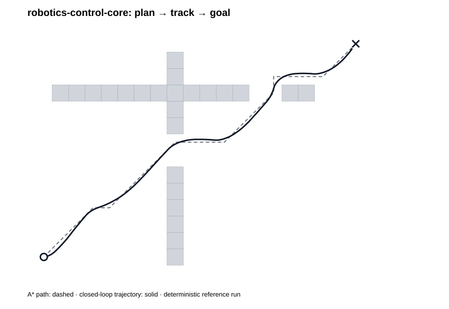

# robotics-control-core

[](https://github.com/tahazarif10/robotics-control-core/actions/workflows/ci.yml)
[](https://github.com/tahazarif10/robotics-control-core/actions/workflows/codeql.yml)


**A deterministic C++20 navigation and control core for a differential-drive mobile robot.**

This repository is intentionally middleware-independent: it exposes the robotics
algorithms, numerical contracts, safety boundaries, tests, and packaging underneath
a future ROS 2 application instead of hiding them inside framework callbacks.

## What it proves

- Modern **C++20** and explicit API contracts
- **A\*** path planning on occupancy grids
- Collision-aware map inflation and **path smoothing**
- **PID** heading control with bounded integral/output
- Interpolated-lookahead **pure pursuit**
- Differential-drive **forward/inverse kinematics**
- **SE(2) odometry**
- Deterministic closed-loop simulation and controller benchmarks
- **CMake**, CTest, Ninja presets, warnings-as-errors
- Installable CMake package exposing `robotics::control`
- GCC + Clang + MSVC CI
- **ASan + UBSan** regression lane
- Dockerized reproducible build
- CodeQL security scanning and Dependabot-managed GitHub Actions
- Tag-driven Linux/Windows release packaging
- Architecture, verification, and engineering documentation

## Architecture

```text
Occupancy Grid
     │
     ├──> Inflation ──> A* ──> Collision-safe smoothing ──┐
     │                                                    │
Current Pose ─────────────────────────────────────────────┼──> Controller
                                                          │      ├─ PID baseline
                                                          │      └─ Pure pursuit
                                                          │
                                                          v
                                                  Body twist (v, ω)
                                                          │
                                                          v
                                                Wheel kinematics
                                                          │
                                                          v
                                                       Odometry
                                                          │
                                                          └──> Goal
```

The original occupancy grid remains the collision oracle during regression tests.
Planning can use an inflated grid to encode controller clearance without redefining
what counts as an obstacle.

## Deterministic evidence

The v0.2 benchmark runs both controllers against the same static map, 20 ms integration
step, differential-drive kinematics, and odometry model:

| Controller | Waypoints | Steps | Travel | Max cross-track | Final error | Collision-free | Goal |
| --- | ---: | ---: | ---: | ---: | ---: | --- | --- |
| PID waypoint baseline | 26 | 545 | 7.158981 m | 0.063708 m | 0.099468 m | yes | yes |
| Pure pursuit + smoothed path | **5** | **479** | **6.905655 m** | **0.052827 m** | **0.097605 m** | yes | yes |

These are deterministic regression measurements for the checked-in fixture, not
hardware-performance or universal controller-superiority claims. See
[Benchmark evidence](docs/BENCHMARKS.md) and
[Verification record](docs/VERIFICATION.md).



## Build and verify

Requirements: CMake 3.24+, a C++20 compiler, and Ninja for presets.

```bash
cmake --preset dev
cmake --build --preset dev --parallel
ctest --preset dev
```

Sanitizers:

```bash
cmake --preset asan
cmake --build --preset asan --parallel
ctest --preset asan
```

Run the original deterministic demo:

```bash
./build/dev/robotics_control_demo trajectory.csv planned_path.csv map.csv
python3 scripts/plot_trajectory.py trajectory.csv planned_path.csv map.csv --output trajectory.png
```

Run the comparative controller benchmark:

```bash
./build/dev/robotics_control_benchmark
```

## Repository layout

```text
include/robotics_control/   public C++ contracts
src/                        planning/control implementations
app/                        demo + deterministic benchmark
tests/                      v0.1 + v0.2 regression contracts
examples/consumer/          installed-package smoke consumer
scripts/                    visualization tooling
docs/                       architecture, benchmarks, verification
.github/workflows/          multi-compiler CI + CodeQL + release
```

## Design decisions

- The core has **no ROS 2 dependency**, so planning/control logic is unit-testable and
  reusable later from `rclcpp` nodes.
- Grid A* and the smoother reject diagonal corner cutting.
- Controller clearance is explicit through occupancy inflation.
- The original occupancy map remains the collision oracle in end-to-end regression.
- All control limits are explicit configuration, not hidden clamps.
- Simulation uses fixed-step integration to keep regression behavior deterministic.
- Public names encode SI units where ambiguity is likely.
- Benchmark results are documented as fixture-level evidence, not generalized claims.

See [Architecture](docs/ARCHITECTURE.md),
[Engineering contract](docs/ENGINEERING.md),
[Benchmark evidence](docs/BENCHMARKS.md),
[Verification record](docs/VERIFICATION.md), and
[Changelog](CHANGELOG.md).

## Consume as a package

After installation, another CMake project can use the exported target directly:

```cmake
find_package(robotics_control_core 0.2 CONFIG REQUIRED)
target_link_libraries(my_robot PRIVATE robotics::control)
```

A standalone smoke consumer lives in [`examples/consumer`](examples/consumer) and
is rebuilt against the installed package in CI. This verifies the install/export
contract rather than only the in-tree build.

## Roadmap

- **v0.1 — complete:** A*, PID, differential-drive kinematics, odometry, deterministic simulation, CI.
- **v0.2 — complete on main:** obstacle inflation, collision-safe smoothing, interpolated pure pursuit, benchmark regression.
- **v0.3 — next:** covariance-aware localization/filter module and deterministic sensor replay.
- **v1.0:** freeze the core API after integration into `ros2-autonomous-mobile-robot`.

## Safety

This is portfolio/research software, not a certified safety controller. See [SECURITY.md](SECURITY.md).

## License

MIT © 2026 Taha Zarif
